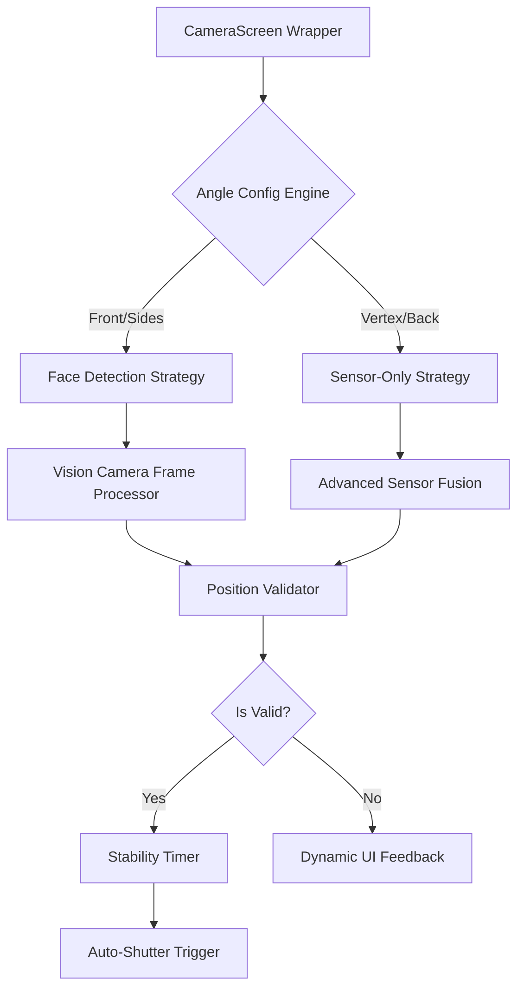

# 📸 SmileCare+ | Smart Self-Capture Tool

[](https://reactnative.dev/)
[](https://expo.dev/)
[](https://www.typescriptlang.org/)
[](https://smilehairclinic.com/)

> **"Professional Hair Analysis Photos, Without the Professional."**
> An AI-powered mobile application that guides users to capture clinical-quality hair transplant photos from 5 critical angles—completely unassisted.

---

## 🎯 Project Overview

This MVP was developed for the **Smile Hair Clinic Hackathon** to solve the challenge of capturing consistent, professional hair analysis photos without clinical assistance.

### The Challenge
Capturing consistent, standardized photos for hair transplant analysis (especially the **Vertex** and **Back Donor** areas) is notoriously difficult for patients doing it alone. Poor angles, bad lighting, and incorrect distances lead to inaccurate doctor assessments.

### The Solution
**SmileCare+** solves this with a **Sensor-Fused Smart Camera** that acts as a virtual photographer. It uses real-time gyroscope data, face detection, and haptic feedback to "lock" the user into the perfect position before automatically taking the shot.

---

## ✨ Key Features

-   ✅ **5-Angle Guided Capture Flow**: Front, Right 45°, Left 45°, Vertex, Back Donor.
-   ✅ **Real-time Sensor Fusion**: Gyroscope + Accelerometer + Kalman Filtering for precise angle detection.
-   ✅ **AR Overlay Guides**: Visual head silhouette and "Traffic Light" feedback system.
-   ✅ **Automatic Shutter**: Captures *only* when position, angle, and stability criteria are met.
-   ✅ **Radar Audio Guidance**: Pitch-based audio feedback for "blind" angles (Vertex/Back).
-   ✅ **Visual Countdown**: 3-2-1 countdown ensures the user holds the pose.
-   ✅ **Photo Review & Retake**: Quality control at each step.

---

## 🏗️ Technical Architecture

The project is built on a robust, modular architecture designed for scalability and precision.



### Tech Stack
-   **Framework**: React Native with Expo SDK 54
-   **Language**: TypeScript
-   **Navigation**: React Navigation (Native Stack)
-   **Camera**: react-native-vision-camera
-   **Sensors**: expo-sensors (DeviceMotion)
-   **Audio**: expo-av / expo-audio
-   **Haptics**: expo-haptics

### Project Structure
```
smile-hair-capture/
├── src/
│   ├── screens/           # CameraScreen (Universal), ReviewScreen, etc.
│   ├── components/        # DynamicFaceGuide, Overlays
│   ├── hooks/             # useSensorData, useAdvancedCapture
│   ├── utils/             # positionValidator, distanceEstimator, audioFeedback
│   ├── constants/         # angles.ts (Configuration Engine)
│   └── assets/            # Sounds and Images
├── App.tsx                # Root component
└── app.json               # Expo configuration
```

---

## 📱 User Experience & Flow

### The "Traffic Light" Feedback System
We simplified complex 3D positioning into 3 colors:
-   🔴 **Red:** Wrong position. (e.g., "Turn Right", "Lift Phone")
-   🟠 **Orange:** Getting close. (Radar sound starts)
-   🟢 **Green:** Perfect lock. (Stability timer starts -> Auto Capture)

### Capture Workflow
1.  **Welcome Screen**: Overview of the process.
2.  **Instructions**: Specific guidance for the current angle.
3.  **Smart Camera**:
    -   **Selfie Mode (Front/Sides)**: Uses Face Detection + IoU to center the face.
    -   **Blind Mode (Vertex/Back)**: Uses Gyroscope + Audio Radar to guide without screen visibility.
4.  **Review**: Confirm photo quality.
5.  **Completion**: View full gallery and share.

---

## 🎨 Angle Configurations

The app uses a sophisticated configuration engine to validate each angle differently:

| # | Angle | Target Area | Validation Strategy | Key Criteria |
|---|-------|-------------|---------------------|--------------|
| 1 | **Front Face** | Front view | Face Detection | Pitch 0°, Yaw 0°, Centered |
| 2 | **Right 45°** | Right profile | Face Detection | Yaw +45°, Turn Right Warning |
| 3 | **Left 45°** | Left profile | Face Detection | Yaw -45°, Turn Left Warning |
| 4 | **Vertex** | Crown/Top | Sensor Only | Pitch -90° (Vertical Down) |
| 5 | **Back Donor** | Nape area | Sensor Only | Pitch -90° (Behind Head) |

---

## 🏆 Hackathon Compliance Checklist

We have meticulously implemented every requirement from the **Smile Hair Clinic Brief**:

-   ✅ **5-Angle Flow:** Implemented strictly as requested.
-   ✅ **Vertex (90°) Capture:** Enforced via sensor pitch validation (-85° to -95°).
-   ✅ **Back Donor Capture:** Enforced via "Behind Head" sensor logic.
-   ✅ **Auto-Shutter:** Triggers only on `Position + Angle + Stability`.
-   ✅ **Android Support:** Optimized distance estimation for diverse Android hardware.
-   ✅ **"Radar" Sound:** Implemented pitch-based audio guidance for blind spots.

---

## � Configuration & Customization

### Adjusting Angle Tolerance
You can fine-tune the strictness of the validation in `src/constants/angles.ts`:

```typescript
phoneAngle: {
  pitch: 90,        // Target angle
  roll: 0,
  tolerance: 20,    // Increase for more lenient detection
}
```

### Changing Success Threshold
Logic for what constitutes a "valid" frame is in `src/utils/positionValidator.ts`:

```typescript
// Position is valid if both accuracies are above threshold
const isValid = angleAccuracy >= 70 && distanceAccuracy >= 60;
```

---

## �🚀 Getting Started

### Prerequisites
-   Node.js (v18 or higher)
-   Expo Go app on your mobile device (Required for Sensor testing)

### Installation

1.  **Navigate to project directory**
    ```bash
    cd smile-hair-capture
    ```

2.  **Install dependencies**
    ```bash
    npm install
    ```

3.  **Start the development server**
    ```bash
    npx expo start
    ```

4.  **Run on Device (Development Build Required)**
    Since this project uses native modules (Vision Camera, Face Detector), it **will not work** on the standard Expo Go app from the App Store. You must create a **Development Build**.

    **Option A: Local Build (Fastest if you have Android Studio/Xcode)**
    ```bash
    # For Android
    npx expo run:android
    
    # For iOS (Mac only)
    npx expo run:ios
    ```

    **Option B: EAS Build (Cloud)**
    ```bash
    # Install EAS CLI
    npm install -g eas-cli
    
    # Configure Build
    eas build:configure
    
    # Create Development Build
    eas build --profile development --platform android
    ```
    *After building, install the APK on your device and run `npx expo start` to connect.*

---

## 🧪 Testing & Troubleshooting

### Manual Testing Checklist
-   [ ] Camera permission granted successfully
-   [ ] Sensor data reading correctly (check debug output)
-   [ ] All 5 angles can be captured
-   [ ] Automatic shutter triggers at correct position
-   [ ] Countdown displays (3-2-1)
-   [ ] Audio feedback (beeps/radar) is audible

### Common Issues
1.  **Sensors not working:** Ensure you are on a physical device, not a simulator.
2.  **Audio not playing:** Check if silent mode is on (iOS often mutes app sounds in silent mode).
3.  **"Wrong Direction" warning:** Ensure you are turning your head, not the phone, for side profiles.

---

## 🔮 Future Roadmap

-   [ ] **AI Hair Analysis:** Integrate ML model to analyze hair density immediately after capture.
-   [ ] **Cloud Sync:** Securely upload photos to Smile Hair Clinic's patient portal.
-   [ ] **AR Hairline Designer:** Allow users to visualize their potential new hairline.

---

## 📄 License & Credits

**Developed for**: Smile Hair Clinic Hackathon 2025 - Mobile App Category
**Purpose**: Professional self-capture tool for hair transplant analysis
**Platform**: iOS & Android (React Native + Expo)

**Made with ❤️ for Smile Hair Clinic**
